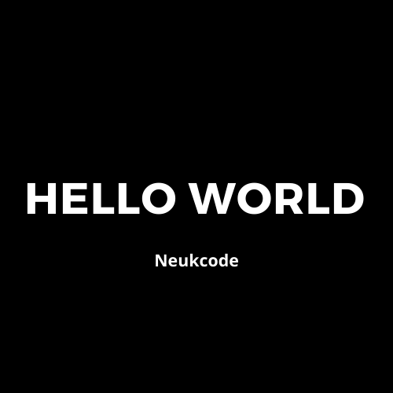

<p align="center">
  <a href="" rel="noopener">
 </a>
</p>

<h3 align="center">Hello World Django</h3>

<div align="center">

[](https://github.com/neukcode/helloworld_django/issues) [](https://github.com/neukcode/helloworld_django/network/members) [](https://github.com/neukcode/helloworld_django/stargazers) [](https://github.com/neukcode/helloworld_django/blob/master/LICENSE.md)

[](https://twitter.com/neukcode?ref_src=twsrc%5Etfw) [](https://twitter.com/intent/tweet?screen_name=neukcode&ref_src=twsrc%5Etfw)


</div>

---

<p align="center"> A simple Hello World Project in Django
    <br> 
</p>

## 📝 Table of Contents

- [About](#about)
- [Getting Started](#getting_started)
- [Built Using](#built_using)
- [Authors](#authors)

## 🧐 About <a name = "about"></a>

A simple Hello World Project in Django.

## 🏁 Getting Started <a name = "getting_started"></a>

- clone project
  ```
  git clone https://github.com/neukcode/helloworld_django
  ```
  ```
  cd helloworld_django/
  ```
- install requirements
  ```
  pip install -r requirements.txt
  ```
- migrate
  ```
  python manage.py migrate
  ```
- runserver
  ```
  python manage.py runserver
  ```

## ⛏️ Built Using <a name = "built_using"></a>

- [DJANGO](https://www.djangoproject.com/) - Backend Framework

## ✍️ Authors <a name = "authors"></a>

- [@harshraj8843](https://github.com/harshraj8843)